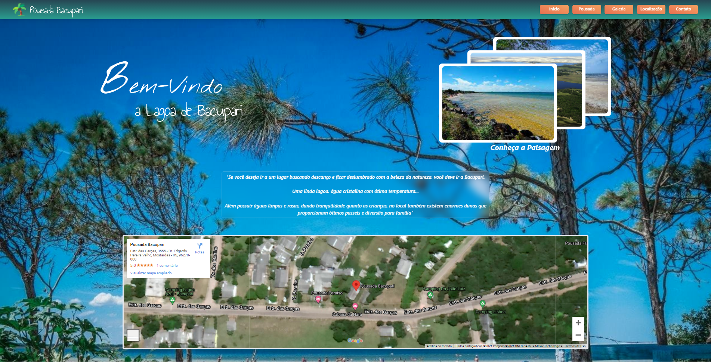
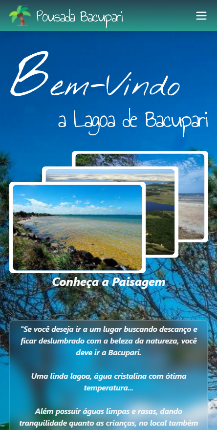
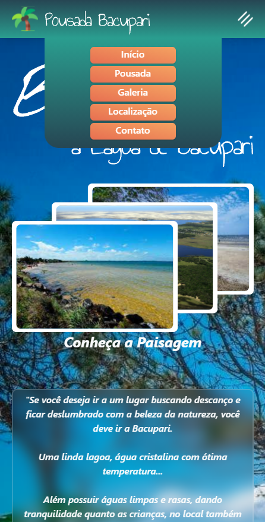

# Projeto - Site Pousada

Aplicação utilizada para aprimorar conhecimentos em React, utilizando o framework css: Tailwind

----------

## Aprendizados

Além de aumentar conhecimentos sobre **state**, **ciclo de vida do componente** em *React*, também foi proveitoso a experiência em utilizar Tailwind que oferece muitos benefícios como:
 - Código enxuto   
 - Facilidade na leitura 
 - Facilidade em implementar reponsividade 

